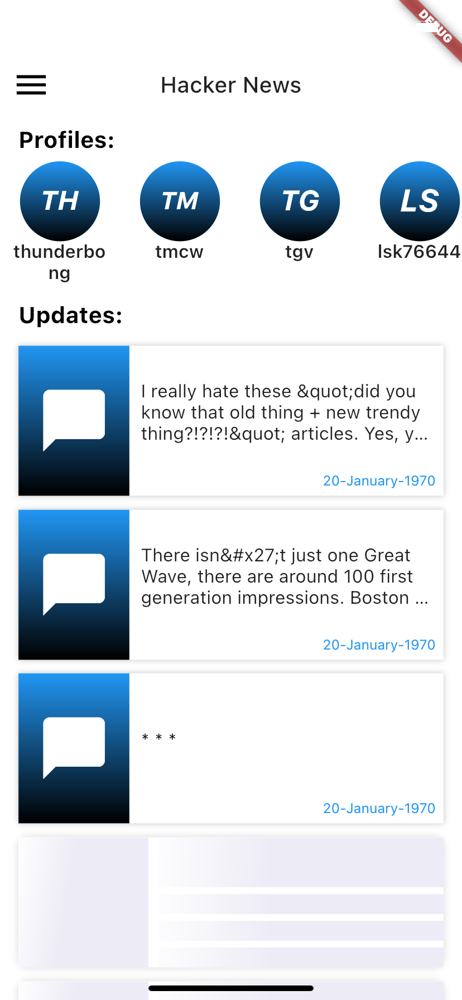
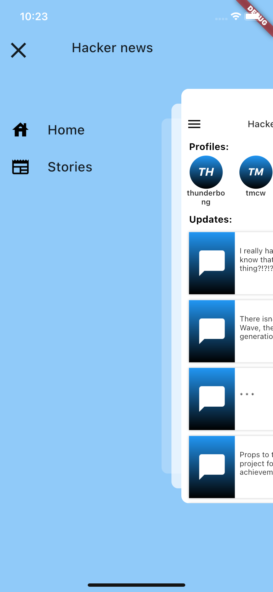
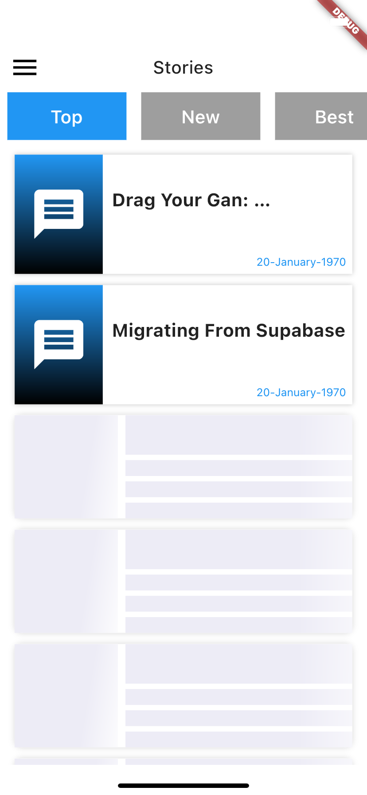
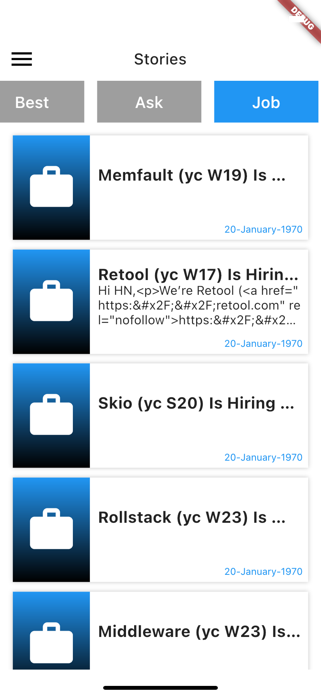

# Hacker News

Hacker news application on 

**Firebase App:**  [link to APK on Firebase](https://appdistribution.firebase.google.com/testerapps/1:761573465149:android:91577d31cc4cec54c25e54/releases/72f612onvo52o?utm_source=firebase-console)

## How to Setup:
1. Clone the repository from [Github repository](https://something)
2. Run `flutter pub get` in the terminal to install dependencies 

        You need flutter installed on your device to run this command

3. Start the application using `flutter run`

## About the Application

### 1. Home Page:
|
|
|

### Features
- Loading screen before homepage
- Homepage which calls the update api
- API calls to
    1. Profile screen using profile Ids
    2. Stories and Messages from the list of Ids in the update list
- zoom drawer application

### 2. Story Page:
|
|
|

### Features
- Shimmer loading screen
- API calls to 
    1. Top Stories
    2. New Stories
    3. Best Stories
    4. Ask Stories
    5. Show Stories
    6. Job Stories
    
    Using Tab navigations
- zoom drawer application

